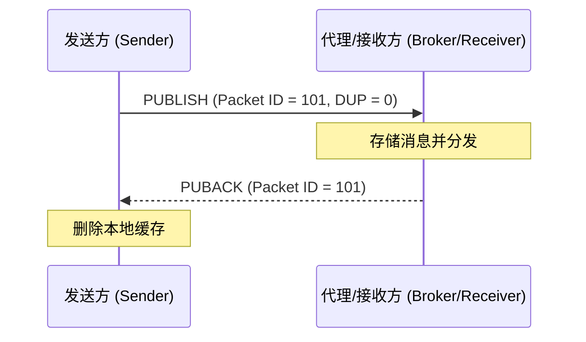
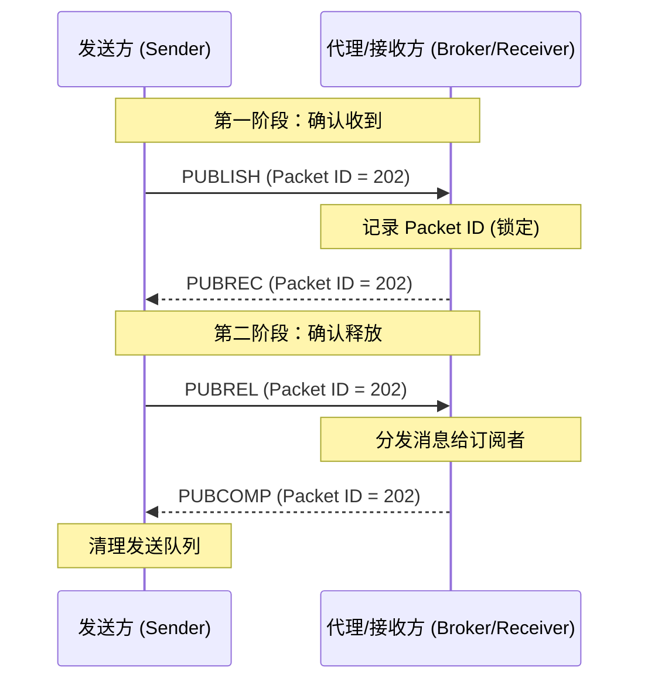

# MQTT
- MQTT：Message Queuing Telemetry Transport，消息队列遥测传输协议
- 传输层是基于TCP/IP协议；
## 核心架构
- 发布/订阅模型；
- 发送者和接收者通过代理（Broker）进行消息中转；
	- **发布者 (Publisher)**：负责发送消息的设备。它将消息发布到特定的“主题（Topic）”。
	- **订阅者 (Subscriber)**：负责接收消息的设备。它向 Broker 订阅感兴趣的“主题”。
	- **代理 (Broker)**：服务端。负责接收发布者的消息，并根据主题将其转发给所有已订阅该主题的订阅者。
## 关键概念
- 主题（Topic)：主题是消息的路由依据；
- Qos（服务质量）：

| **QoS 等级** | **名称**               | **描述**           | **特点**          |
| ---------- | -------------------- | ---------------- | --------------- |
| **QoS 0**  | 最多一次 (At most once)  | 消息只发一次，不保证到达。    | 最省资源，可能丢包。      |
| **QoS 1**  | 至少一次 (At least once) | 确保消息到达，但可能会重复收到。 | 常用，需确认应答。       |
| **QoS 2**  | 只有一次 (Exactly once)  | 确保消息到达且仅到达一次。    | 开销最高，用于金融或严苛场景。 |
## 保留消息
- publish时将retain标志设置为true时，broker除了把消息发给订阅者，还会专门存储一份副本在对应的topic下，每当有新的客户端订阅这个topic时，broker会把存底的那条消息推给它；

## MQTT控制数据报组成
| **组成部分**                   | **长度**   | **是否必须** | **说明**                                     |
| -------------------------- | -------- | -------- | ------------------------------------------ |
| **固定报头 (Fixed Header)**    | 2 ~ 5 字节 | **必须**   | 包含报文类型（如 PUBLISH）、标志位（如 Retain、QoS）以及剩余长度。 |
| **可变报头 (Variable Header)** | 视类型而定    | 可选       | 包含报文标识符、主题名或 MQTT 5.0 的属性等。并不是所有报文都有。      |
| **有效载荷 (Payload)**         | 视数据而定    | 可选       | 实际发送的内容（如传感器数据、JSON）。心跳包（PINGREQ）等不含载荷。    |
## MQTT控制报类型
|**十进制值**|**报文名称**|**传输方向**|**描述**|
|---|---|---|---|
|**1**|**CONNECT**|Client → Server|客户端请求连接服务端。|
|**2**|**CONNACK**|Server → Client|连接确认。|
|**3**|**PUBLISH**|双向|发布消息。|
|**4**|**PUBACK**|双向|发布确认（针对 QoS 1）。|
|**5**|**PUBREC**|双向|发布收到（QoS 2 握手第 1 步）。|
|**6**|**PUBREL**|双向|发布释放（QoS 2 握手第 2 步）。|
|**7**|**PUBCOMP**|双向|发布完成（QoS 2 握手第 3 步）。|
|**8**|**SUBSCRIBE**|Client → Server|客户端订阅主题。|
|**9**|**SUBACK**|Server → Client|订阅确认。|
|**10**|**UNSUBSCRIBE**|Client → Server|客户端取消订阅。|
|**11**|**UNSUBACK**|Server → Client|取消订阅确认。|
|**12**|**PINGREQ**|Client → Server|心跳请求（Ping）。|
|**13**|**PINGRESP**|Server → Client|心跳响应（Pong）。|
|**14**|**DISCONNECT**|双向|断开连接（5.0 中支持服务端主动发）。|
|**15**|**AUTH**|双向|**(仅 5.0)** 增强型认证交换报文。|
## qos1和qos2可靠性保障
| **特性**   | **QoS 1**                  | **QoS 2**               |
| -------- | -------------------------- | ----------------------- |
| **保障级别** | 保证到达，可能重复。                 | 保证到达，绝不重复。              |
| **交互次数** | 2 次报文交换。                   | 4 次报文交换。                |
| **带宽消耗** | 较低。                        | 较高。                     |
| **适用场景** | 传感器数据采集（丢一两个点没关系，重复了也无所谓）。 | 指令下发、金融交易（绝对不能执行两次的操作）。 |
### qos1
- 至少到达一次（可能有重复）；
- 两次握手；
- 发送方持续充传，直到收到确认；

### qos2
- 仅送达一次
- 四次握手

## MQTT四次握手和TCP三次握手的区别
- 它们不是OSI模型同层的协议

|**特性**|**TCP 三次握手**|**MQTT QoS 握手 (以 QoS 2 为例)**|
|---|---|---|
|**所属层级**|传输层 (Layer 4)|应用层 (Layer 7)|
|**目的**|**建立连接**：确保双方都准备好收发二进制流。|**确认业务**：确保一条特定的“消息”被准确处理。|
|**频率**|**一次性**：每个长连接通常只在开始时握手一次。|**高频**：每发布一条 QoS 2 消息，都要握手四次。|
|**颗粒度**|**字节流**：只管把 0 和 1 发过去，不关心数据代表什么。|**消息体**：关心的是这一条完整的 JSON 或指令是否送达。|
- TCP握手只是保证可以把数据发送到对方主机的网卡
- MQTT握手是应用层可以收到并业务上处理请求；

## 为什么物联网适合使用MQTT
- **开销极小**：最小的数据包报文头仅为 2 字节，非常节省流量和电量。
- **双向通信**：设备既可以上传数据（发布），也可以接收控制指令（订阅）。
- **解耦性强**：发布者和订阅者不需要知道对方的 IP，甚至不需要同时在线。
- **实时性强**：采用长连接，延迟远低于频繁建立连接的 HTTP。

## MQTT利用发布订阅模式支持client/server
- MQTT5.0引入了请求/响应特性；
- 通过请求topic和响应topic来模拟请求/响应模式；
- 过程：（1）发送方在发送请求时会告知接收方将response发送到某个固定的响应地址；（2）接收方收到请求后将回复发送至目标响应topic；

