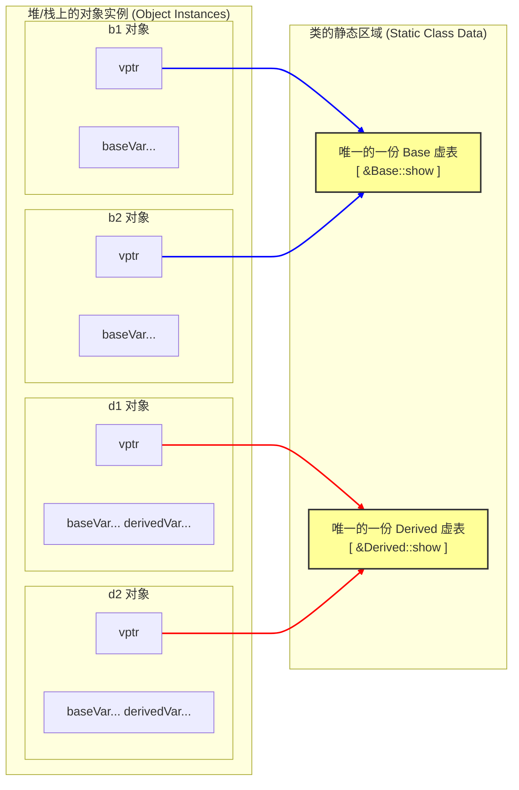
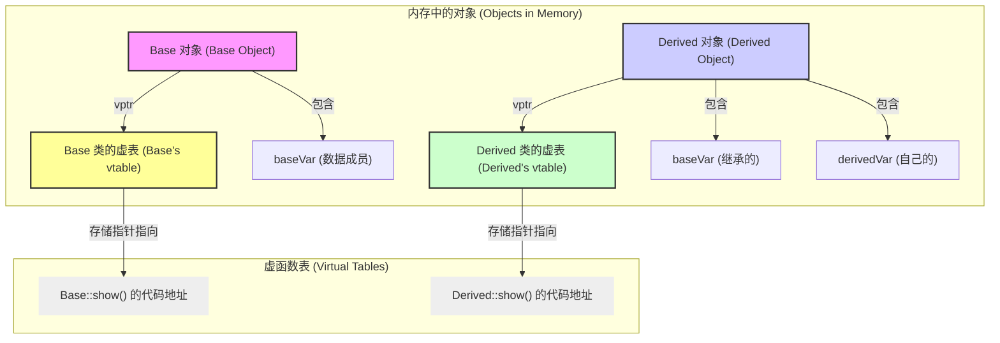

# C++

## C++基础
### sizeof关键字
- 定义：是C语言中的运算符，用来计算一个类型/对象所占用的内顿大小；
- sizeof的计算在编译期，它是个操作符，不是函数；
- 编译器在编译过程中会创建一张专门的表格用来保存变量名及其对应的数据类型、地址、作用域等信息，使用sizeof是从这张表格中查询到符号的长度；
- 重点：
	- 指针的大小永远固定，取决于处理器位数，32位是4字节，64位是8字节；
	- struct结构体要考虑字节对齐；
	- 字符串数组要算上末尾的结束符；
	- 数组作为入参会退化为指针，按照指针计算大小；
```C++
void test(int a[]) {

std::cout <<"test: " << sizeof(a) << std::endl; // 8，按照指针类型来计算

}

int main() {

char a[] = "Hello, World!"; // 14,(包含'\0')

int b = 10; // 4

int c[] = {1, 2, 3, 4, 5}; // 20

int* d = &b; // 8

test(c);

return 0;
}
```
#### 与strlen区别
- strlen是cstring库中的函数，用来计算c字符串长度，其运算对象只能是char[]，返回的字符串长度不包含结尾的结束符;
```C++
char a[] = "Hello, World!"; 
std::cout << strlen(a) << std::endl; //13,不包含结束符
std::cout << sizeof(a) << std::endl; //14
```
- sizeof 操作符的运算对象是各种对象或结构体，返回其所占内存大小的字节数；
#### 数组作为函数入参时退化为指针
- 在C++中，数组作为函数参数传递时，实际传递的是指向数组首元素的指针，不是拷贝整个数组传递；
### const关键字
- 关键字，表示常量
- 可以修饰变量、指针、函数
- const关键字的主要作用是为了保证变量安全性和代码可读性；
#### const修饰变量
- 只读变量，不可修改
```C++
const int a = 10;
a = 20; // 编译错误，a 是只读变量，不能被修改
```
const只读变量在编译时校验，修改const变量会导致编译失败；
#### const修饰函数参数
- 表示该函数内部不会修改该参数的值；
- 如果引用作为入参，如不会修改其值，尽量声明为const引用
#### const修饰函数返回值
- 函数返回值为只读
#### const修饰指针或引用
```C++
int a = 10;
const int b = 20;
const int* p ; //指向只读变量的指针,不能通过p来修改变量的值

p = &a;//可以指向变量a
p = &b;//可以指向常量b
*p = 30;//错误，不能通过p来修改变量的值

int* const q = &a; //只读指针：指向变量的常量指针,不能指向其他变量
*q = 30;//可以修改变量的值
q = &b;//错误，不能指向其他变量

const int* const r = &a; //只读指针指向只读变量：指向只读变量的指针,不能指向其他变量,不能修改变量的值
*r = 30;//错误，不能修改变量的值
r = &b;//错误，不能指向其他变量

const int& s = a; //常量引用：指向变量的常量引用,不能指向其他变量,不能修改变量的值
s = 30;//错误，不能修改变量的值
s = b;//错误，不能指向其他变量
```

#### const修饰成员函数
- const修饰成员函数时，不能修改成员变量的值；
- const对象只能调用const成员方法；

### static关键字
#### static修饰全局变量
- 将变量的作用域限定在当前文件中，其它文件无法访问该变量
- 在程序启动是被初始化（main函数执行之前），生命周期与程序一样长
#### static修饰局部变量
- 变量在函数调用结束后不被销毁，一直存在于内存中，下次调用时还可以使用；
#### static 修饰函数
- 将函数作用域限定在当前文件中，其它文件无法访问该函数
#### static修饰成员变量和函数
- 不需要创建对象就可以直接访问该成员或函数
- static函数不能访问成员变量：如果在static函数中尝试访问非静态成员变量，编译器会报错
```C++
class MyClass {
public:
    static void myStaticFunction() {
        // 以下代码会导致编译错误
        // cout << this->myMemberVariable << endl;
    }
private:
    int myMemberVariable;
};
```
### volatile关键字
- 修饰变量
- 禁止编译器对该变量优化
- 每次访问该变量都从内存中读取值，而不是从寄存器或缓存中；
- 对于多个线程同时操作的变量，推荐使用volatile修饰
### 字节对齐
- 字节对齐可以提高内存访问速度，但可能造成一定程度的空间浪费；
#### 字节对齐类型
1. 自然对齐边界：对于基本数据类型，以其大小作为对齐边界（int和float是4字节，char是1字节，short为2字节，double为8字节）；
2. 结构体对齐：结构体的大小会根据其最大对齐成员的边界进行对齐（比如结构体成员中最长的类型是 int，那么结构体的大小会以4的整数倍对齐）
3. 联合体对齐：联合体的对齐边界取决于其最大对齐边界的成员。联合体的大小等于其最大大小的成员，因为联合体的所有成员共享相同的内存空间。
4. 编译器指令：#pragma pack 可以使用该编译器指令修改对齐大小
```C++
#pragma pack(push, 1) // 设置字节对齐为 1 字节，取消自动对齐
#pragma pack(pop) // 恢复默认的字节对齐设置
struct MyStruct {
double a; // 8 个字节
char b; // 本来占一个字节，但是接下来的 int 需要起始地址为4的倍数
//所以这里也会加3字节的padding
int c; // 4 个字节
// 总共: 8 + 4 + 4 = 16
};

struct MyStruct1 {
char b; // 本来1个字节 + 7个字节padding
double a; // 8 个字节
int c; // 本来 4 个字节，但是整体要按 8 字节对齐，所以 4个字节padding
// 总共: 8 + 8 + 8 = 24
};
```
### 字节序
#### 大端序
- 高位字节存储在低地址处，低位字节存储在高地址处；
- 如数字0x12345678，按照存储地址从低到高的存储内容是12｜34｜56｜78
#### 小端序
- 低位字节存储在低地址处，高位字节存储在高地址处：
- 如数字0x12345678，按照存储地址从低到高的存储内容是78｜56｜34｜12
### struct和class区别
- struct中成员默认public，class中成员默认private；
- struct默认public继承，class继承默认private继承；
- struct不能用于定义模版参数，class可以；
- struct通常用于定义一些基本数据类型组合；
### define
- 预处理指令，预处理阶段编译器直接对内容做文本替换，**不做类型检查**
- 一般定义宏的用处：定义常量；创建宏函数
- 可能导致不合理的计算，单纯的文本替换可能将表达式写很多次
- 没有作用域限制，定义之后都能用
```C++
#define MAX(a, b) ((a) > (b) ? (a) : (c))

int x = 1;
int y = MAX(x++, 10);
// 宏定义 x++ 会被执行两次, 因为 x++ 会被替换到两个地方，使用内联函数则不会出现这个问题
```
### inline
- 内联函数，是个函数
- **有类型检查**，编译期间会尝试替换函数体
- 内联不一定每次生效，是否生效取决于编译器
### typedef
- 类型定义关键字，为现有类型创建别名；
- 在编译阶段处理，有类型检查；
- 受命名空间、类等结构的作用域限制；
- 通常用于定义复杂的类型的别名，提高代码可读性；
```C++
typedef std::map<std::string, std::vector<int>> StringToIntVectorMap;
```
- 可以用于定义模版类型的别名，但现在更推荐使用using关键字
### explicit
- 一般类的单参构造函数需要加explicit关键字修饰；
- 避免类构造时的隐式类型转换；
```C++
class MyInt {
public:
    explicit MyInt(int n) : num(n) {}
private:
    int num;
};
int main() {
	MyInt a = 10; // 注意，这段代码有两个步骤： 1. int 类型的 10 先隐式类型转换为 MyInt 的一个临时对象
              //   2. 隐式类型转换后的临时对象再通过复制构造函数生成 a
              // 3构造函数被explicit修饰后这行代码就会出现编译错误；
}
```
### extern关键字
- 只声明不定义，让编译器在链接阶段在其它源文件中查找定义；
```C++
// file1.cpp
#include <iostream>
extern int global_var;

int main() {
  std::cout << global_var << std::endl;
  return 0;
}

// file2.cpp
int global_var = 42;
```
### mutable关键字
- mutable变量可以在const成员函数中修改；
## C++面向对象
### 面向对象的三大特性
#### 封装
- 将属性和操作这些属性的方法封装在一个类中；
- 只保留必要的对外接口，隐藏内部实现；
- 提高软件可重用性、减少耦合、减轻维护负担
#### 继承
- 继承实现了IS-A关系
- 一个类从另一个类那里获得其属性和方法的过程；
- 继承遵循里氏替换原则，子类对象必须能够替换掉所有父类对象；
#### 多态
- 编译时多态：同名方法的重载（同名，不同个数的参数）
- 运行时多态：虚函数，程序运行时才能确定指向的对象引用的具体类型；
### SOLID原则
#### 单一责任原则
- 一个类只负责一件事，如果这个类需要做的事情过多，就需要拆分这个类
#### 开放封闭原则
	类应该对扩展开放，对修改关闭
- 在添加新功能时少修改原有结构和代码
#### 里氏替换原则
	子类对象必须能替换掉所有父类对象
- 继承是一种IS- A的关系，子类要能当成父类来用并且比父类更特殊
#### 接口分离原则
- 接口功能应该专一、明确、具体，多个专门的接口比一个大的总接口要好；
#### 依赖倒置
	 高层模块不应该依赖低层模块，二者都应该依赖抽象
	 抽象不应以来细节，细节应依赖抽象
- 依赖倒置的目标是：让高层模块在低层实现发生变化时，尽量不用改代码；
- **接口应该由使用者来定义，而不是实现者**
- 举例：
	- 错误依赖：
	```
	TaskManager（使用者） --> FileLogger（具体实现）
	```
	- 正确依赖 (ILogger是通用日志组建的接口)：
```
	TaskManager --> ILogger   （定义接口的一方）
	FileLogger  --> ILogger   （实现接口的一方）
```

### 多态的实现
- 区分静态多态和动态多态的方法：看决定调用具体类型的时机是编译时还是运行时；
#### 编译时多态
- 函数重载：同名不同参数的函数，编译时确定使用哪一个；
- 模版函数：根据传递参数的不同类型，自动生成对应类型的函数代码；
```C++
template <class T>
T GetMax (T a, T b) {
   return (a>b?a:b);
}

int main () {
   int i=5, j=6, k;
   long l=10, m=5, n;
   k=GetMax<int>(i,j);
   n=GetMax<long>(l,m);
   cout << k << endl;
   cout << n << endl;
   return 0;
}
```
编译时，编译器回生成两个GetMax函数实例，参数类型分别是int和long类型；
#### 运行时多态
- 虚函数：在基类中声明函数，在派生类中重写它；
- 虚函数实现多态的方式：**使用基类指针或引用 指向派生类对象时**，可以调用到派生类中重写的函数，从而实现多态；
- 多态构成的条件必须满足：（1）通过基类指针或者引用调用虚函数；（2）被调用的函数必须是虚函数，而且必须完成对虚函数的重写；
```C++
class Shape {
   public:
      virtual int area() = 0;
};

class Rectangle: public Shape {
   public:
      int area () { 
         cout << "Rectangle class area :"; 
         return (width * height); 
      }
};

class Triangle: public Shape{
   public:
      int area () { 
         cout << "Triangle class area :"; 
         return (width * height / 2); 
      }
};

int main() {
   Shape *shape;
   Rectangle rec(10,7);
   Triangle  tri(10,5);

   shape = &rec;
   shape->area();

   shape = &tri;
   shape->area();

   return 0;
}
```

### 虚函数
- 虚函数是通过一张虚函数表（V-Table）来实现的；
- 虚表中存的是一个类的虚函数的地址表；每个包含虚函数的类都有一张自己的虚表，这个类的实例内存中有一个虚表指针；
#### 虚表指针
- 如果该类包含虚函数，编译器会在该类的**对象**内存布局的最前面插入一个隐藏的虚表指针，**虚表指针属于对象**；
- 虚表指针指向该类对应的虚表；
- 每个包含虚函数的**对象**都有自己的虚表指针；
- 存储位置：存储在该对象的内存空间中；
#### 虚函数表
- 对于每一个包含虚函数的类，编译器在编译期间只会生成唯一一份虚函数表；
- **虚表是一个数组，里面顺序存放该类所有虚函数的地址**
- **虚表属于类，虚表指针属于对象**；
- 存储位置：虚表通常存储在程序的可执行代码段或只读数据段中，它是静态存在的；

#### 虚函数实现多态的方式
- **编译时，子类的虚表先拷贝父类的虚表，等子类重写父类中的虚函数后，其（子类）虚表中对应位置的会替换为指向重写后方法的入口地址**；
*(虚表指针与对象关系示意图)*


- 通过子类对象的指针/引用调用子类的虚函数时还需要查询虚表么？
	- **通常需要，因为该子类还有可能有更深层的子类（孙子类）存在**。而编译器无法确认this指针指向的是它本身还是某个更深层的子类方法，因此需要查表来保证调用到正确的重写实现；
	- 以下情况可以跳过虚表，直接进行静态绑定：
	- （1）使用final关键字修饰，编译器就知道该类/方法没有更深层的重写了，就可以直接调用函数地址；
```C++
void Derived::func() override final { ... } // 明确告诉编译器：没人能再改我了
```
	-（2）编译器能精准确定对象类型：在同一函数内创建对象并立即调用，编译器能通过逃逸分析确定类型（例子如下）；
```C++
void sample() {
    Derived d; 
    d.func(); // 编译器百分之百确定 d 就是 Derived，通常会直接调用而不查表
}
```

### 纯虚函数
- 纯虚函数是一种在基类中只声明但没有实现的虚函数；
- 作用是定义一个接口，派生类必须要实现它；
- **包含纯虚函数的类被称为抽象类，抽象类无法实例化，即不可能有抽象类对象**；
### C++构造函数不能是虚函数
- 构造函数调用时初始化还未完成，虚表可能尚未设置，因此在构造函数中使用虚函数表可能导致未定义的行为；
- 只有执行完了对象的构造，虚表才会被正确的初始化；
### C++基类的析构函数需要是虚函数
- 原因：如果基类的析构函数不是虚函数，那么通过基类指针删除派生类对象时，只会执行基类的析构函数，派生类的析构函数就不会被调用，导致内存泄漏，如：
```C++
#include <iostream>

class Base {
public:
    // 注意，这里的析构函数没有定义为虚函数
    ~Base() {
        std::cout << "Base destructor called." << std::endl;
    }
};

class Derived : public Base {
public:
    Derived() {
        resource = new int[100]; // 分配资源
    }

    ~Derived() {
        std::cout << "Derived destructor called." << std::endl;
        delete[] resource; // 释放资源
    }

private:
    int* resource; // 存储资源的指针
};

int main() {
    Base* ptr = new Derived();
    delete ptr; // 只会调用Base的析构函数，Derived的析构函数不会被调用
    return 0;
}
```
如果将基类的析构函数声明为虚函数，那么派生类的析构函数也会执行，如：
```C++
class Base {
public:
    virtual ~Base() {
        std::cout << "Base destructor called." << std::endl;
    }
};

class Derived : public Base {
public:
    ~Derived() {
        std::cout << "Derived destructor called." << std::endl;
    }
};

int main() {
    Base* ptr = new Derived();
    delete ptr; // 调用Derived的析构函数，然后调用Base的析构函数
    return 0;
}
```

### 成员函数不能既是template又是virtual的
- 原因是编译时需要为虚函数生成虚表，但模版函数可能有很多个实例，具体数量要等编译完成后才能知道，因此在编译过程中无法生成确定的虚函数表条目；
### 类对象初始化和析构
#### 类初始化
1. 先按照声明顺序初始化基类，如有虚基类则先初始化虚基类；
2. 按照声明顺序初始化类成员变量
3. 执行构造函数
#### 类析构
	类析构顺序和构造顺序完全相反
- **析构函数中不建议抛出异常（throw），也尽量不要写可能发生异常的逻辑，因为析构函数一般是自动调用的，一般没有catch异常的地方，同时析构函数负责释放内存，发生异常可能会导致内存释放过程执行不完整，导致内存泄漏**；
- 如果析构函数中有可能发生异常的逻辑，可以自己实现trycatch逻辑来处理异常，处理逻辑可以abort也可以忽略异常（比如打一行日志）；
### 浅拷贝和深拷贝
#### 浅拷贝
	仅复制对象的基本类型成员和指针成员的值，不复置指针指向的内存
- 浅拷贝可能导致两个对象共享相同资源，从而引发潜在问题，如内存泄漏、意外修改共享资源；
- 编译器默认实现的拷贝构造就是浅拷贝；
#### 深拷贝
	不仅复制对象的基本类型成员和指针成员的值，还复制指针指向的内存
- 要实现深拷贝通常需要自己实现构造函数；
### this指针
- this指针是指向当前对象的指针；
- this指针可以用来访问类的成员变量和成员函数，以及在成员函数中引用当前对象;
- **static函数中无法使用this指针，因为this作为隐式形参，实际是成员函数的局部变量，所以只能用在成员函数内部，并且只有在通过对象调用成员函数时才给this赋值**；
```C++
#include <iostream>
class MyClass {
public:
    MyClass(int value) : value_(value) {}

    // 成员函数中使用 this 指针访问成员变量
    void printValue() const {
        std::cout << "Value: " << this->value_ << std::endl;
    }

    // 使用 this 指针实现链式调用
    MyClass& setValue(int value) {
        this->value_ = value;
        return *this; // 返回当前对象的引用
    }

private:
    int value_;
};

int main() {
    MyClass obj(10);
    obj.printValue(); // 输出 "Value: 10"

    // 链式调用 setValue 函数
    obj.setValue(20).setValue(30);
    obj.printValue(); // 输出 "Value: 30"

    return 0;
}
```
## C++内存管理

### C++内存分区
#### 代码区
- 存放程序的二进制代码，它是只读的；
#### 全局/静态存储区
- 存放全局变量和静态变量；
#### 栈区
- 存放函数调用时的局部变量，函数参数及返回地址；当函数调用退出后，分配的这部分内存将被回收；
#### 堆区
- 动态分配内存的区域（new或者malloc），这部分内存需要手动释放；
#### 常量区
- 存储常量数据，例如字符串字面量和其他编译时常量。这个区域通常也是只读的。
```C++
#include <iostream>
int main() {
	char* c="abc";  // abc在常量区，c在栈上。
  return 0;
}
```
#### 指针与内存模型
- 指针用来存储地址
```C++
int a = 10;
int* p = &a;
```
&是取地址符，意为将变量a的首地址赋值给指针p，p也叫指向a的指针；
```C++
float f = 1.0;
short c = *(short*)&f;
```
上述代码的解释：**将变量f的前两个byte取出来然后按照short的方式解释，然后赋值给c**；

```C++
short c = 1;
float f = *(float*)&c; 
```

上述代码的解释：从变量c的首地址开始取4个字节，然后按照float的编码方式去解释，但是c是short类型只占两个字节，那就会访问到相邻的后面两个字节，这时候有可能出现内存访问越界；
#### void指针
- void指针就是通用指针，其最大用处是实现泛型编程，因为任何指针都可以被赋给void指针，void指针也可以被转换回原来的指针类型，并且这个过程指针实际指向的地址不会变；
```C++
int num;
int *pi = &num; 
void* pv = pi;
pi = (int*) pv; 
```

- **不能对void指针解引用，因为不知道实际指向什么类型，因此不确定解引用时要往后读取多大的内存**；
- 指针数组：数组中存放指针；
```C++
int *p[3];
```
- 数组指针：指向数组的指针；
```C++
int (*p)[3];
```

### 引用和指针的对比
（图源：https://csguide.cn/cpp/memory/difference_of_pointers_and_ref.html#%E7%AE%80%E5%8D%95%E6%80%BB%E7%BB%93）
*(引用与指针对比示意图，图源：csguide.cn)*
- 引用区别于指针的特性是编译器约束的，引用由编译器保证初始化；
- 指针和引用的自增(++）和自减含义不同，指针是指针运算, 而引用是代表所指向的对象对象执行++或--；
#### 函数调用栈
- 调用栈中一般包含：实惨、返回地址、变量等；
### RAII
- 定义：资源获取即初始化；将资源的生命周期与某个对象的生命周期绑定在一起；确保对象生命周期结束时，按照资源获取的相反顺序释放所有资源；
- 使用举例：在析构函数中释放锁；
- RAII类实现步骤：
	- 设计一个类封装资源，资源可以是内存、文件、socket、锁等；
	- 在构造函数中进行资源的初始化，比如申请内存、打开文件、申请锁
	- 在析构函数中执行释放和销毁操作；
### 智能指针
- 智能指针是可以自动管理内存的指针，它可以在不需要手动释放内存的情况下，确保对象被正确地销毁。
- 常用的智能指针有：std::unique_ptr和std::shared_ptr
	- std::unique_ptr：独占所有权，保证指向的内存只能由一个std::unique_ptr拥有，不能共享所有权；当std::unique_ptr超出作用域时，其指向的内存会自动释放；
	- std::shared_ptr：共享所有权；当最后一个shared_ptr超出作用域时，所指向的内存才会被自动释放；shared_ptr采用引用计数；
- shared_ptr常用API：
	- 构造：`std::shared_ptr<int>ptr = std::make_shared<int>(42);`
	- reset(): 释放当前 `shared_ptr` 的所有权，将其设置为 `nullptr`。如果当前 `shared_ptr` 是最后一个拥有对象所有权的智能指针，则会删除对象。
	- use_count():返回引用个数；
	- swap():交换两个shared_ptr:`ptr1.swap(ptr2)`
- std::weak_ptr:
	- 主要与shared_ptr配合使用，作用是：**（1）解决shared_ptr循环引用的问题**:weak_ptr不会增加引用计数，因可以在两个shared互相引用时，将其中一个替换为weak，来解决循环计数无法清零的问题; **（2）观察shared_ptr对象**：`std::weak_ptr`可以用作观察者，监视`std::shared_ptr`对象的生命周期。它不会增加引用计数，因此不会影响资源的释放；
	- **理解weak_ptr的思路：weak_ptr的适用场景：一切应该不具有对象所有权，又想安全访问对象的情况**
	- expired():检查对象是否被销毁
	- lock():将自己升级为shared_ptr
```C++
auto sp = wp.lock(); 
if (sp) 
	{ 
		sp->DoSomething(); 
	}
```

### malloc、new、free、delete区别
- 语法不同：`malloc/free`是一个C语言的函数，而`new/delete`是C++的运算符。
- 分配内存的方式不同：`malloc`只分配内存，而`new`会分配内存并且调用对象的构造函数来初始化对象。
- 返回值不同：`malloc`返回一个 void 指针，需要自己强制类型转换，而`new`返回一个指向对象类型的指针。
- malloc 需要传入需要分配的大小，而 new 编译器会自动计算所构造对象的大小
- malloc执行失败时返回null指针，new内存分配失败时会抛出异常；
#### 使用new操作符来分配对象内存时会经历三个步骤
1. 分配一个足够大的、原始的、未命名的内存空间；
2. 执行构造函数并传入初始值；
3. 返回一个指向该对象的指针；
#### 使用delete操作符来释放对象内存时会经历的两个步骤
1. 调用对象的析构函数
2. 释放内存空间
### 野指针和悬空指针
- 野指针：未初始化或者已被释放的指针，访问野指针可能会导致未定义的行为；
- 悬空指针：指向已经被释放的内存的指针；
### C++ 常见内存错误
1. 间接引用坏指针；
2. 读未初始化的内存
```C++
/* Return y = Ax */
int *matvec(int **A, int *x, int n)
{
    int i, j;
    
    int *y = (int *)Malloc(n * sizeof(int));
    
    for (i = 0; i < n; i++)
        for (j = 0; j < n; j++)
            y[i] += A[i][j] * x[j];
    return y;
}
```
这段代码的问题是不正确的假设向量y被初始化为0，正确的方法是将y[i]设置为0；
3. 栈缓冲区溢出，比如不检查输入串的大小就写入缓冲区；
4. 误解指针运算：常见的错误是忘记了指针的算术操作是以它们指向的对象的大小为单位来进行的，而这种大小単位并不一定是字节。
```C++
int *search(int *p, int val)
{
    while (*p && *p != val)
        p += sizeof(int); /* Should be p++ */
    return p;
}
```
5. 引用不存在的变量
```C++
int *stackref ()
{
    int val;
    
    return &val;
}
```
6. 内存泄漏：忘记释放已分配的堆内存；
```C++
void leak(int n)
{
    int *x = (int *)Malloc(n * sizeof(int));
    return;  /* x is garbage at this point */
}
```

### nullptr和NULL的区别
- nullptr是c++11新引入的关键字，用于表示空指针；
- NULL在C++中的定义实际是一个整数值0；

### auto关键字
- C++11中新引入的用来做类型推导的关键字；
- 类型推导在编译阶段进行，不会影响程序执行性能；
- auto不能用于非初始化的变量声明；
- auto使用最佳实践：
	1. 当类型名称冗长或复杂时，使用 `auto`
	2. 迭代器和范围for循环中优先使用 `auto`
	3. 当变量类型显而易见时，可以使用 `auto`
	4. 当需要保持const或引用语义时，使用 `const auto`、`auto&` 或 `const auto&`
	5. 避免在可能导致代码可读性下降的地方使用 `auto`
