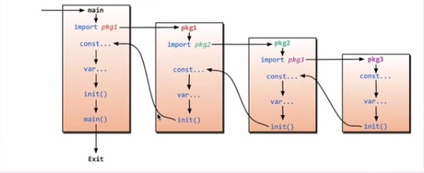
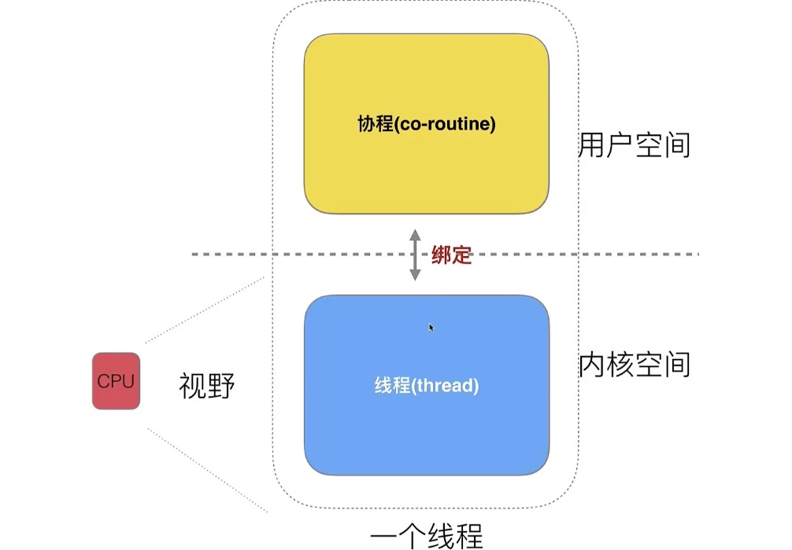
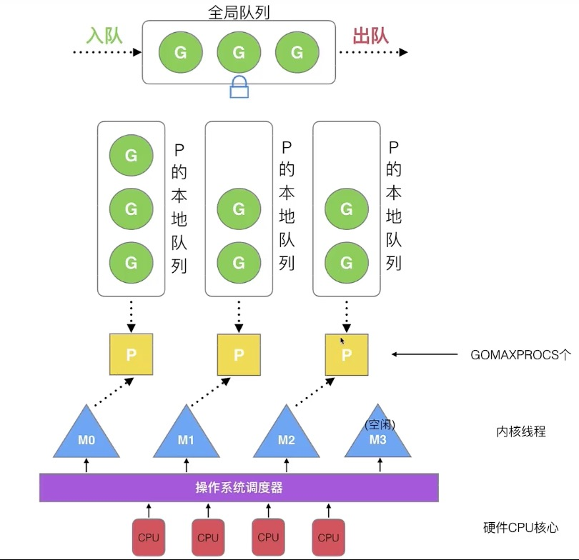

# 📚 Go 语言学习笔记

> 这是一个简单的 Go 语言学习笔记。

## 📋 目录

- [概述](#概述)
- [变量声明](#变量声明)
- [常量 & 常量计数器（iota）](#常量--常量计数器iota)
- [import导包](#import导包)
- [指针](#指针)
- [defer 关键字](#defer-关键字)
- [slice](#slice)
- [map](#map)
- [面向对象](#面向对象)
- [反射（reflect）](#反射reflect)
- [结构体标签](#结构体标签)
- [goroutine](#goroutine)
- [Channel](#channel)
- [go module](#Go-Module)
- [GPM](#GPM)

---

## 概述

### go语言优势
- 强大的标准库
	- runtime系统调度机制
	- GC垃圾回收
	- 丰富的标准库
- 简单易学
	- 25个关键字
	- 内嵌支持C语法
	- 面向对象特征（封装、继承、多态）
	- 跨平台

### go语言不足
- 包管理：使用的大部份三方库都托管在github上；

## 变量声明

常用的四种变量声明方式：

```go
// 变量声明
var a int      // 一：声明一个变量，类型为int，默认值为0
var b int = 20 // 二：声明一个变量，类型为int，初始值为20
var c = 30     // 三：声明一个变量，自动推断类型
d := 40        // 四：声明一个变量，类型为int，初始值为40

var aa, bb, cc int = 1, 2, 5 // 声明多个变量，类型为int
var dd, ee, ff = 1, "2", 5   // 声明多个变量，自动推断类型

fmt.Printf("a: %T, b: %T, c: %T, d: %T\n", a, b, c, d) //打印变量类型
fmt.Println("a: ", a, "b: ", b, "c: ", c, "d: ", d)
fmt.Println("aa: ", aa, "bb: ", bb, "cc: ", cc)
fmt.Println("dd: ", dd, "ee: ", ee, "ff: ", ff)
```

> **注意**: 方法四只能在函数体内声明变量

## 常量 & 常量计数器（iota）

```go
const (
	CAT   = iota //iota关键字是常量计数器，从0开始，每行递增1
	DOG          //1
	MOUSE        //2
)

const (
	a, b = iota + 1, iota + 2 //1,2
	c, d = iota * 2, iota * 3 //4,5
	e, f                      //6,7
)
```

## import导包

- import时会执行对应包的init函数



- 在Go语言中，使用go.mod时，导入路径应该使用**模块名**作为前缀，而不是绝对路径

```go
package main

import (
	"gostudy1/lib1"
	"gostudy1/lib2"
)

func main() {
	lib1.Test()
	lib2.Test()
}
```

```go
package lib1

import "fmt"

func Test() {
	fmt.Println("lib1 Test")
}

func init() {
	fmt.Println("lib1 init")
}
```

```go
package lib2

import "fmt"

func Test() {
	fmt.Println("lib2 Test")
}

func init() {
	fmt.Println("lib2 init")
}
```

以上代码运行后输出：

```
lib1 init //import时执行
lib2 init // import时执行
lib1 Test
lib2 Test
```

> **重要**: 函数名首字母大写即表示该函数是public，可以在外部访问；函数名首字母时小写，只能在本package内访问；

### 匿名import

```go
import (
	_ "gostudy1/lib1"
	"gostudy1/lib2"
)
```

匿名导入lib1，不使用lib1的方法，但会执行lib1的init（）

## 指针

```go
func changeValue(p *int) {
	*p = 100
}
func main() {
	var a int = 10
	changeValue(&a)
}
```

## defer 关键字

### defer执行顺序
先写的defer先入栈，后写的后入栈；调用时出栈；因此先写的defer后被调用；

### defer和return的顺序
return先执行，defer后执行:

```go
func deferfunc() int {
	defer fmt.Println("defer func called")
	return 0
}

func returnfunc() int {
	defer fmt.Println("return func called")
	return 0
}

func test() int {
	defer deferfunc()
	return returnfunc()
}

func main() {
	test()
}
```

结果是：

```
return func called
defer func called
```

## slice

定义一个切片：

```go
// 定义一个长度为10的数组
slice := []int{1, 2, 3}
// 定义一个slice,未初始化
slice2 := make([]int, 3)
```

判断数组是不是为空：

```go
//判断一个slice是否为空
if slice2 == nil {
	fmt.Println("slice is nil")
}
```

**重要概念:**
- `len()`: 数组首尾指针之间的长度
- `cap()`: 数组预分配的容量

```go
// 声明一个int切片，长度为3，容量为4:len = 3,cap = 4
numbers := make([]int, 3, 4)
numbers = append(numbers, 1)
// 触发动态扩容，len = 5，cap = 8，cap新增的数量和之前的cap一致
numbers = append(numbers, 3)

// len = 0,cap = 0
var sliceTest []int
// len = 1,cap = 1
sliceTest = append(sliceTest, 1)
// len = 2,cap = 2
sliceTest = append(sliceTest, 2)
```

### 切片截取
采用`[a : b]`的方式表示截取[a,b)的范围；
***注意该方式不进行拷贝，只会将新切片的头尾指针指向a和b，通过新切片下标修改数据同样会修改原有切片的数据，如果要进行拷贝构造新切片需要使用copy()函数***

```go
// 初始化长度为2的数组
sliceTest2 := make([]int, 2)
// 只拷贝了前两个，因为sliceTest2长度为2
copy(sliceTest[:3], sliceTest2)
// sliceTest2=[10 0]
sliceTest2[0] = 10

var sliceTest3 []int
copy(sliceTest[:3], sliceTest3)
//编译报错，因为sliceTest3没有初始化，lenth是0
sliceTest3[0] = 7
```

## map

### 声明方式

```go
// 方式一：使用make关键字构造
myMap2 := make(map[int]string, 3)
// 方式二：直接声明并初始化
myMap3 := map[int]string{
	0: "c++",
	1: "java",
}
```

### 使用

删除元素：

```go
// 删除map中的元素(key)
delete(myMap3, 1)
```

遍历：

```go
for _, value := range myMap3 {
	fmt.Println(value)
}
```

map传参是引用传递：

```go
changeMap(myMap3) // m[1] = "python"
fmt.Println(myMap3)

func changeMap(m map[int]string) {
	m[1] = "python"
}
```

## 面向对象

### 封装

go以包（package）为单位讨论封装

使用type关键字定义结构体：

```go
// 如果类名首字母大写，表示其他包也能访问
type Person struct {
	// 如果变量名首字母大写，表示该属性对外可访问，下述age则为私有属性
	Name string
	age  int
}
func SetName(this *Person) {
	this.Name = "Lisa"
}
```

类名、属性名首字母大写，表示该属性对外可访问（其它包内也可访问）

### 继承

在子类中直接声明父类对象：

```go
type Student struct {
	person Person
	Score  int
}
```

### 多态

使用interface来定义一个父类接口，本质是指针
子类需要实现所有父类的接口方法

声明一个接口：

```go
type AnimalIF interface {
	Sleep()
	GetColor() string
}
```

声明一个子类方法：

```go
type Dog struct {
	color string
}

func (this *Dog) GetColor() string {
	return this.color
}

func (this *Dog) Sleep() {
	fmt.Println("Dog is sleeping")
}
```

## 反射（reflect）

- go中的每个变量底层都会对应一个pair<type,val>
- 类型断言是判断type是不是对应数据类型
- `reflect.TypeOf(i interface{})`: 动态获取输入接口中的值的类型，如果接口为空则返回nil
- `reflect.ValueOf(i interface{})`: 获取输入接口中数据的值，如果为空接口则返回0
- 使用reflect需要import reflect包

```go
type Person struct {
	Name string
	Age  int
}

func reflectTest(arg interface{}) {
	t := reflect.TypeOf(arg)
	fmt.Println("type of arg is ", t)

	v := reflect.ValueOf(arg)
	fmt.Println("value of arg is ", v)

	k := v.Kind()
	fmt.Println("kind of arg is ", k)

	for i := 0; i < t.NumField(); i++ {
		field := t.Field(i)
		value := v.Field(i).Interface()
		fmt.Println(field.Name, value)
	}
}
```

执行以上代码，输出：

```
type of arg is  main.Person
value of arg is  {Lisa 18}
kind of arg is  struct
Name Lisa
Age 18
```

## 结构体标签

go中可以使用结构体标签进行json序列化/反序列化

进行json序列化/反序列化需要引入头文件：

```go
"encoding/json"
```

结构体标签示例：

```go
type Person struct {
	Name string `json:"name"`
	Age  int    `json:"age"`
	Sex  int    `json:"sex"`
}
```

```go
// 序列化 struct->json
person := Person{"Lisa", 18, 1}
jsonStr, err := json.Marshal(person)
if err != nil {
	fmt.Println("json marshal failed,err:", err)
	return
}
fmt.Println(string(jsonStr))

// 反序列化 json->struct
person2 := Person{}
err = json.Unmarshal(jsonStr, &person2)
if err != nil {
	fmt.Println("json unmarshal failed,err:", err)
	return
}
fmt.Println(person2)
```

输出示例：

```
{"name":"Lisa","age":18,"sex":1}
{Lisa 18 1}
```

## goroutine

- 多线程引入的问题：
	- CPU线程切换成本较高（系统调用、上下文切换），造成CPU时间浪费；线程数量越多，切换成本越大，浪费CPU时间越多
	- 多线程伴随同步竞争（锁、资源冲突等），使得开发设计变复杂

- 多进程壁垒：
	- 进程内存占用高

### 协程 （co-routine）

- 将线程分为两部分：内核部分和用户态部分，用户态部分称为协程，对CPU不可见



### go协程调度机制（GMP）



#### 调度器的主要设计策略

1. **复用线程**：避免频繁的创建、销毁线程
2. **利用并行**：GOMAXPROCS设置P的数量
3. **抢占调度**：在syscall或长时间阻塞时，让出CPU
4. **全局G队列**：当M执行完G后，会从全局队列取G

#### 创建goroutine

```go
go func() {
	fmt.Println("Hello from goroutine")
}()
```

## Channel

Channel是Go语言中用于goroutine之间通信的机制

### 有缓冲和无缓冲channel区别

#### 无缓冲channel

```go
ch := make(chan int) // 无缓冲
```

- 发送和接收必须同时准备好
- 否则会阻塞

#### 有缓冲channel

```go
ch := make(chan int, 3) // 有缓冲，容量为3
```

- 缓冲区未满时可以发送
- 缓冲区非空时可以接收

### 关闭channel

```go
close(ch) // 关闭channel
```

### channel与range

可以使用range来迭代不断操作channel

```go
for data:= range c {
    // 使用range来从c中读数据
    fmt.println(data)
}
```

###channel与select
可以使用selecr监控多个channel状态；

```go
	select {
	case c <- 1:
		//c中可写
		fmt.Println("c")
	case <-quit:
		//quit中可读,退出
		fmt.Println("quit")
	default:
		fmt.Println("default")
	}
```

## Go Module

### GOPATH 工作模式

#### 弊端
* 没有版本控制的概念
* 无法同步一致第三方版本号；
* 无法指定当前项目引用的第三方版本号；

### 常用go mod 命令

|命令 | 说明 |
| --- | --- | 
|go mod init | 生成go.mod文件|
|go mod download|下载go.mod文件中指明的所有依赖|
|go mod tidy|管理依赖：添加缺失的依赖并移除未使用的依赖|
|go mod graph |展示依赖关系|

## GPM

### GPM模型
- G：goroutine：go协程
- P：processor：调度器
- M：machine（thread）：内核线程


